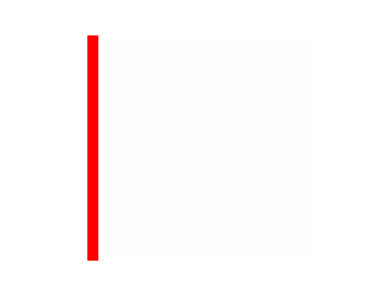

A library to quickly make Python animations (wrapper to matplotlib). Useful for visualizing tensors (of shape time x height x width) or making more complex aimations.

## Installation

```bash
pip install creategif
```

## How to
Just some imports and create a tensor of a moving bar.
```python
import numpy as np
import creategif
import matplotlib.pyplot as plt

# Create moving bar tensor
clip = np.zeros((80, 40, 40))
for t in range(80):
idx = t % 40
clip[t, :, idx:idx+2] = 1
```

And then  animate in a notebook and export as a gif.
```python
an = creategif.TensorAnimator(clip, fps=30, vmin=-1, vmax=1, cmap="bwr")
an.to_notebook()  # Display in notebook
an.to_gif()  # Save as gif
```
<p align="center">

</p>

Or make more complex animations with subplots.

```python
class ModelAnimation(creategif.Animation):

    def __init__(self):
        self.fig, ax = plt.subplots(1, 2, figsize=(10, 3))
        self.x = np.arange(0, 2*np.pi, 0.01)
        self.plot1, = ax[0].plot(self.x, np.sin(self.x))
        self.plot2 = ax[1].imshow(clip[0], vmin=-1, vmax=1, cmap="bwr")
        ax[0].set_title("Squiggly line")
        ax[1].set_title("Moving bar")
        for i in [1]:
            ax[i].set_xticks([])
            ax[i].set_yticks([])

    # Only function to override 
    def render(self, i):
        self.plot1.set_ydata(np.sin(self.x + i / 50))
        self.plot2.set_data(clip[i])

an = creategif.Animator(ModelAnimation(), n_frames=80).to_notebook()
```
<p align="center">

</p>


## License

CreateGif is released under the MIT license.